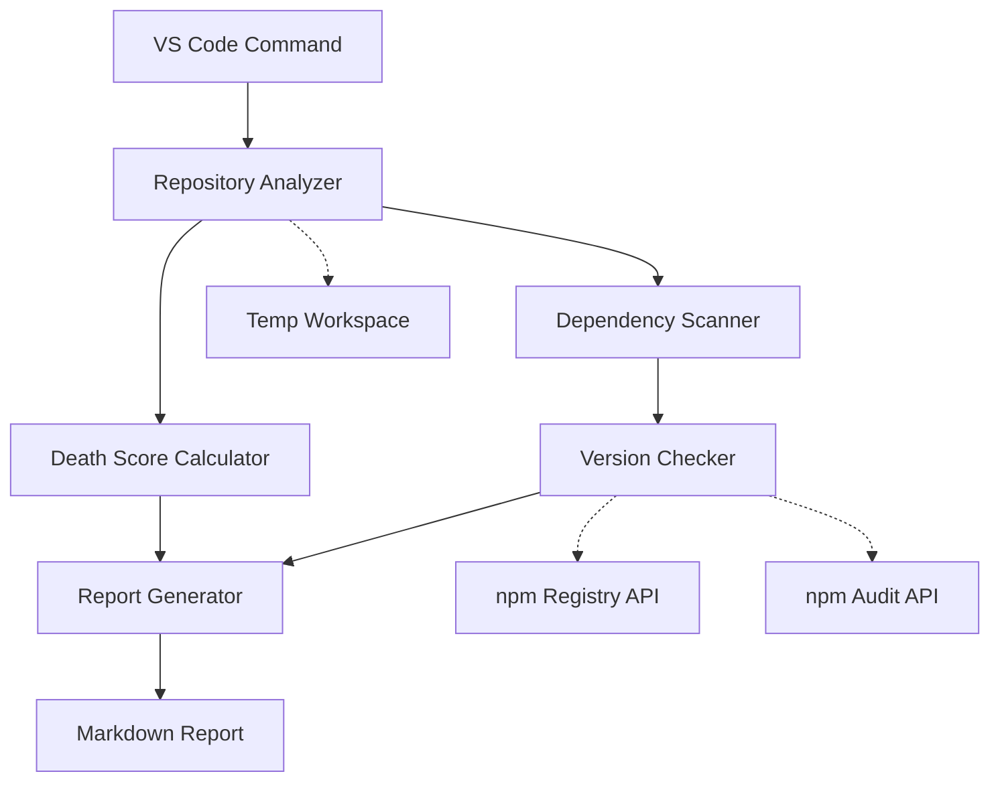

# Design Document

## Overview

The MVP Resurrection Flow is designed as a modular VS Code extension that analyzes abandoned GitHub repositories and generates comprehensive modernization reports. The system follows a pipeline architecture where each component performs a specific analysis task and passes results to the next stage. The design emphasizes separation of concerns, testability, and extensibility for future language support.

The core workflow consists of five stages:
1. Repository acquisition and validation
2. Death score calculation based on abandonment indicators
3. Dependency discovery and inventory
4. Version comparison and vulnerability detection
5. Report generation with actionable recommendations

## Architecture

### High-Level Architecture

The system follows a pipeline pattern with clear boundaries between components:

```
GitHub URL → Repository Analyzer → Death Score Calculator → Dependency Scanner → Version Checker → Report Generator → Markdown Report
```

### Component Interaction



### Technology Stack

- **VS Code Extension API**: Command registration, progress reporting, file system operations
- **Octokit**: GitHub API integration for repository metadata
- **Simple Git**: Repository cloning and git operations
- **npm Registry Client**: Package version queries
- **npm Audit**: Security vulnerability detection
- **File System (fs/promises)**: Async file operations for parsing package.json

## Components and Interfaces

### Repository Analyzer

**Responsibilities:**
- Validate GitHub URLs (HTTPS and SSH formats)
- Clone repositories to temporary workspace
- Extract repository metadata (last commit date, size, structure)
- Handle cleanup of temporary files

**Interface:**
```typescript
interface RepositoryMetadata {
  url: string;
  lastCommitDate: Date;
  sizeInBytes: number;
  localPath: string;
  hasPackageJson: boolean;
}

interface RepositoryAnalyzer {
  validateUrl(url: string): boolean;
  cloneRepository(url: string): Promise<RepositoryMetadata>;
  cleanup(localPath: string): Promise<void>;
}
```

### Death Score Calculator

**Responsibilities:**
- Calculate death score (0-100) based on multiple factors
- Determine if repository is abandoned (score > 50)
- Generate death certificate with abandonment details

**Interface:**
```typescript
interface DeathCertificate {
  deathScore: number;
  isAbandoned: boolean;
  lastCommitDate: Date;
  monthsSinceLastCommit: number;
  outdatedMajorDependencies: number;
  contributingFactors: string[];
}

interface DeathScoreCalculator {
  calculateScore(metadata: RepositoryMetadata, dependencies: DependencyInfo[]): DeathCertificate;
}
```

### Dependency Scanner

**Responsibilities:**
- Parse package.json for dependencies and devDependencies
- Extract exact versions from package-lock.json if available
- Build dependency inventory
- Detect non-JavaScript projects

**Interface:**
```typescript
interface Dependency {
  name: string;
  currentVersion: string;
  isDev: boolean;
}

interface DependencyInventory {
  dependencies: Dependency[];
  hasLockFile: boolean;
  totalCount: number;
}

interface DependencyScanner {
  scanProject(localPath: string): Promise<DependencyInventory>;
}
```

### Version Checker

**Responsibilities:**
- Query npm registry for latest versions
- Compare current vs latest versions
- Identify major vs minor updates
- Check for security vulnerabilities
- Calculate versions behind

**Interface:**
```typescript
interface VersionInfo {
  dependency: Dependency;
  latestVersion: string;
  versionsBehind: number;
  updateType: 'major' | 'minor' | 'patch' | 'current';
  vulnerabilities: Vulnerability[];
}

interface Vulnerability {
  severity: 'critical' | 'high' | 'moderate' | 'low';
  title: string;
  fixedInVersion?: string;
}

interface VersionChecker {
  checkVersions(inventory: DependencyInventory): Promise<VersionInfo[]>;
  batchQuery(packages: string[]): Promise<Map<string, string>>;
}
```

### Resurrection Report Generator

**Responsibilities:**
- Aggregate all analysis results
- Generate markdown report with sections
- Prioritize recommendations
- Save report to file system

**Interface:**
```typescript
interface ResurrectionReport {
  executiveSummary: ExecutiveSummary;
  deathCertificate: DeathCertificate;
  dependencyAnalysis: VersionInfo[];
  recommendations: Recommendation[];
  securityVulnerabilities: Vulnerability[];
}

interface ExecutiveSummary {
  repositoryUrl: string;
  deathScore: number;
  totalDependencies: number;
  outdatedDependencies: number;
  criticalVulnerabilities: number;
}

interface Recommendation {
  priority: 'critical' | 'high' | 'medium' | 'low';
  action: string;
  reason: string;
}

interface ReportGenerator {
  generateReport(
    metadata: RepositoryMetadata,
    deathCert: DeathCertificate,
    versions: VersionInfo[]
  ): ResurrectionReport;
  saveReport(report: ResurrectionReport, outputPath: string): Promise<void>;
}
```

## Data Models

### Core Data Flow

```typescript
// Input
type GitHubUrl = string;

// Stage 1: Repository Analysis
interface RepositoryMetadata {
  url: string;
  lastCommitDate: Date;
  sizeInBytes: number;
  localPath: string;
  hasPackageJson: boolean;
}

// Stage 2: Death Assessment
interface DeathCertificate {
  deathScore: number;
  isAbandoned: boolean;
  lastCommitDate: Date;
  monthsSinceLastCommit: number;
  outdatedMajorDependencies: number;
  contributingFactors: string[];
}

// Stage 3: Dependency Discovery
interface DependencyInventory {
  dependencies: Dependency[];
  hasLockFile: boolean;
  totalCount: number;
}

interface Dependency {
  name: string;
  currentVersion: string;
  isDev: boolean;
}

// Stage 4: Version Analysis
interface VersionInfo {
  dependency: Dependency;
  latestVersion: string;
  versionsBehind: number;
  updateType: 'major' | 'minor' | 'patch' | 'current';
  vulnerabilities: Vulnerability[];
}

interface Vulnerability {
  severity: 'critical' | 'high' | 'moderate' | 'low';
  title: string;
  fixedInVersion?: string;
}

// Stage 5: Final Report
interface ResurrectionReport {
  executiveSummary: ExecutiveSummary;
  deathCertificate: DeathCertificate;
  dependencyAnalysis: VersionInfo[];
  recommendations: Recommendation[];
  securityVulnerabilities: Vulnerability[];
}
```

### Version Comparison Logic

Version comparison follows semantic versioning (semver) rules:
- Major update: `1.x.x` → `2.x.x` (breaking changes)
- Minor update: `1.1.x` → `1.2.x` (new features)
- Patch update: `1.1.1` → `1.1.2` (bug fixes)

Versions behind calculation:
```
versionsBehind = (majorDiff * 1000) + (minorDiff * 100) + patchDiff
```


## Correctness Properties

*A property is a characteristic or behavior that should hold true across all valid executions of a system—essentially, a formal statement about what the system should do. Properties serve as the bridge between human-readable specifications and machine-verifiable correctness guarantees.*

### Repository Analysis Properties

**Property 1: GitHub URL validation accepts both formats**
*For any* valid GitHub repository URL in either HTTPS or SSH format, the URL validator should accept it as valid
**Validates: Requirements 1.1, 1.5**

**Property 2: Cloned repositories contain expected files**
*For any* successfully cloned repository, the local path should contain the repository's files and the metadata should include valid last commit date and size
**Validates: Requirements 1.2, 1.4**

**Property 3: Cleanup removes temporary files**
*For any* repository analysis (successful or failed), temporary files should be removed after completion
**Validates: Requirements 8.5**

### Death Score Properties

**Property 4: Death score is bounded**
*For any* repository metadata and dependency list, the calculated death score should be between 0 and 100 inclusive
**Validates: Requirements 2.1**

**Property 5: Old commits increase death score**
*For any* repository where the last commit is older than 24 months, the death score should be at least 40 points higher than a repository with the same characteristics but recent commits
**Validates: Requirements 2.2**

**Property 6: Outdated dependencies increase death score**
*For any* repository with N outdated major dependencies (where N ≤ 3), the death score should increase by N * 10 points, capped at 30 points
**Validates: Requirements 2.3**

**Property 7: Abandonment classification threshold**
*For any* repository with a death score above 50, it should be classified as abandoned; any repository with a score of 50 or below should not be classified as abandoned
**Validates: Requirements 2.4**

**Property 8: Death certificate completeness**
*For any* analyzed repository, the death certificate should contain death score, abandonment status, last commit date, months since last commit, outdated dependency count, and contributing factors
**Validates: Requirements 2.5**

### Dependency Scanning Properties

**Property 9: Complete dependency extraction**
*For any* valid package.json file, all dependencies and devDependencies should be extracted with both package name and version for each entry
**Validates: Requirements 3.1, 3.2, 3.5**

**Property 10: Lock file usage**
*For any* project with both package.json and package-lock.json, the scanner should use the lock file for exact version information
**Validates: Requirements 3.3**

### Version Checking Properties

**Property 11: All dependencies are checked**
*For any* dependency inventory, the version checker should query the npm registry for every package in the inventory
**Validates: Requirements 4.1**

**Property 12: Version comparison correctness**
*For any* pair of semantic versions (current, latest), the version checker should correctly determine if current is behind latest
**Validates: Requirements 4.2**

**Property 13: Update type classification**
*For any* dependency with a newer version available, the update should be correctly classified as major, minor, or patch based on semantic versioning rules
**Validates: Requirements 4.3, 4.4**

**Property 14: Versions behind calculation**
*For any* outdated dependency, the versions behind count should accurately reflect the semantic version difference
**Validates: Requirements 4.5**

### Security Properties

**Property 15: Vulnerability severity validation**
*For any* recorded vulnerability, the severity level should be one of: critical, high, moderate, or low
**Validates: Requirements 5.2**

**Property 16: Vulnerability counting**
*For any* list of vulnerabilities, the count by severity level should equal the total number of vulnerabilities
**Validates: Requirements 5.4**

**Property 17: Critical vulnerabilities prioritized**
*For any* list of dependencies with mixed severity vulnerabilities, dependencies with critical or high severity should appear before those with moderate or low severity
**Validates: Requirements 5.5**

### Report Generation Properties

**Property 18: Report completeness**
*For any* completed analysis, the generated report should include all required sections: executive summary, death certificate, dependency analysis table, and prioritized recommendations
**Validates: Requirements 6.2, 6.3, 6.4, 6.5**

**Property 19: Conditional vulnerability section**
*For any* analysis with vulnerabilities found, the report should include a security vulnerabilities section; for any analysis with no vulnerabilities, this section should be omitted
**Validates: Requirements 6.6**

**Property 20: Report persistence round-trip**
*For any* generated report, saving it to disk and reading it back should produce the same markdown content
**Validates: Requirements 6.7**

### Error Handling Properties

**Property 21: Error logging includes context**
*For any* error that occurs during analysis, the error log should include contextual information about what operation was being performed
**Validates: Requirements 8.1**

**Property 22: Network retry with exponential backoff**
*For any* failed network request, the system should retry up to 3 times with exponentially increasing delays between attempts
**Validates: Requirements 8.2**

**Property 23: Partial reports on errors**
*For any* analysis that encounters a critical error, a partial report should be generated with all successfully collected data
**Validates: Requirements 8.3**

**Property 24: Errors documented in reports**
*For any* analysis where errors occurred, the final report should include details about what errors were encountered
**Validates: Requirements 8.4**

### Performance Properties

**Property 25: Batched registry queries**
*For any* dependency inventory with multiple packages, version queries should be batched rather than sent individually
**Validates: Requirements 7.2**

**Property 26: Progress updates emitted**
*For any* analysis operation, progress updates should be emitted at key stages (cloning, scanning, checking versions, generating report)
**Validates: Requirements 7.4**

## Error Handling

### Error Categories

1. **Network Errors**
   - GitHub API failures
   - npm registry unavailable
   - Clone failures due to connectivity
   - **Strategy**: Retry with exponential backoff (3 attempts), then fail gracefully with partial results

2. **Validation Errors**
   - Invalid GitHub URL format
   - Malformed package.json
   - Invalid version strings
   - **Strategy**: Fail fast with clear error messages, no retry

3. **File System Errors**
   - Permission denied
   - Disk space issues
   - Temp directory creation failures
   - **Strategy**: Attempt cleanup, report error to user

4. **Timeout Errors**
   - Analysis exceeds 5 minutes
   - Individual operations hang
   - **Strategy**: Cancel operation, return partial results

### Error Recovery

```typescript
interface AnalysisError {
  stage: 'clone' | 'scan' | 'version-check' | 'report';
  error: Error;
  recoverable: boolean;
  partialData?: Partial<ResurrectionReport>;
}

interface ErrorHandler {
  handleError(error: AnalysisError): Promise<PartialReport>;
  retry<T>(operation: () => Promise<T>, maxAttempts: number): Promise<T>;
}
```

### Cleanup Guarantees

- Temporary directories are cleaned up using try-finally blocks
- Cleanup occurs even when errors are thrown
- VS Code extension deactivation triggers cleanup of any remaining temp files
- Failed clones are removed immediately

## Testing Strategy

### Unit Testing

The testing approach uses **Vitest** as the test framework for its speed, modern API, and excellent TypeScript support.

**Unit Test Coverage:**
- URL validation with various formats (valid HTTPS, SSH, invalid URLs)
- Death score calculation with different input combinations
- Version comparison logic with edge cases (pre-release versions, build metadata)
- Dependency parsing with malformed package.json files
- Report generation with missing optional data
- Error handling paths

**Example Unit Tests:**
```typescript
describe('URL Validation', () => {
  it('accepts valid HTTPS GitHub URLs', () => {
    expect(validateUrl('https://github.com/user/repo')).toBe(true);
  });
  
  it('accepts valid SSH GitHub URLs', () => {
    expect(validateUrl('git@github.com:user/repo.git')).toBe(true);
  });
  
  it('rejects non-GitHub URLs', () => {
    expect(validateUrl('https://gitlab.com/user/repo')).toBe(false);
  });
});
```

### Property-Based Testing

The system uses **fast-check** for property-based testing, which is the standard PBT library for TypeScript/JavaScript.

**Configuration:**
- Each property test runs a minimum of 100 iterations
- Custom generators for domain-specific types (GitHub URLs, semantic versions, package.json structures)
- Shrinking enabled to find minimal failing cases

**Property Test Requirements:**
- Each property-based test MUST include a comment tag referencing the design document property
- Tag format: `// Feature: mvp-resurrection-flow, Property N: [property description]`
- Each correctness property MUST be implemented by exactly ONE property-based test

**Example Property Test:**
```typescript
import fc from 'fast-check';

// Feature: mvp-resurrection-flow, Property 4: Death score is bounded
test('death score is always between 0 and 100', () => {
  fc.assert(
    fc.property(
      fc.record({
        lastCommitDate: fc.date(),
        outdatedMajorDeps: fc.integer({ min: 0, max: 10 })
      }),
      (input) => {
        const score = calculateDeathScore(input);
        expect(score).toBeGreaterThanOrEqual(0);
        expect(score).toBeLessThanOrEqual(100);
      }
    ),
    { numRuns: 100 }
  );
});
```

**Custom Generators:**
```typescript
// Generator for valid GitHub URLs
const githubUrlArb = fc.oneof(
  fc.tuple(fc.string(), fc.string()).map(([user, repo]) => 
    `https://github.com/${user}/${repo}`
  ),
  fc.tuple(fc.string(), fc.string()).map(([user, repo]) => 
    `git@github.com:${user}/${repo}.git`
  )
);

// Generator for semantic versions
const semverArb = fc.tuple(
  fc.integer({ min: 0, max: 20 }),
  fc.integer({ min: 0, max: 50 }),
  fc.integer({ min: 0, max: 100 })
).map(([major, minor, patch]) => `${major}.${minor}.${patch}`);

// Generator for package.json structures
const packageJsonArb = fc.record({
  name: fc.string(),
  version: semverArb,
  dependencies: fc.dictionary(fc.string(), semverArb),
  devDependencies: fc.dictionary(fc.string(), semverArb)
});
```

### Integration Testing

- Test full pipeline with real (small) GitHub repositories
- Mock npm registry API to avoid rate limiting
- Verify report generation end-to-end
- Test VS Code command integration

### Test Organization

```
src/
├── analyzer/
│   ├── repository-analyzer.ts
│   └── repository-analyzer.test.ts
├── calculator/
│   ├── death-score.ts
│   └── death-score.test.ts
├── scanner/
│   ├── dependency-scanner.ts
│   └── dependency-scanner.test.ts
├── checker/
│   ├── version-checker.ts
│   └── version-checker.test.ts
└── generator/
    ├── report-generator.ts
    └── report-generator.test.ts
```

## Implementation Notes

### VS Code Integration

- Command: `codecrypt.resurrect` registered in package.json
- Input: Quick pick or input box for GitHub URL
- Progress: Use `vscode.window.withProgress` for long operations
- Output: Show report in new editor tab with markdown preview

### Temporary Workspace Management

- Use `os.tmpdir()` for cross-platform temp directory
- Create unique subdirectories per analysis: `codecrypt-{timestamp}-{random}`
- Store temp paths in extension context for cleanup on deactivation

### Rate Limiting

- npm registry: 50 requests per minute for unauthenticated
- Batch queries in groups of 10 with 1-second delays between batches
- Implement exponential backoff for 429 responses

### Extensibility Points

Future language support can be added by:
1. Creating new scanner implementations (e.g., `PythonDependencyScanner`)
2. Implementing language-specific version checkers
3. Registering scanners in a factory pattern based on detected project type

```typescript
interface LanguageScanner {
  detectProjectType(path: string): boolean;
  scanDependencies(path: string): Promise<DependencyInventory>;
}

const scanners: LanguageScanner[] = [
  new JavaScriptScanner(),
  // Future: new PythonScanner(), new RubyScanner(), etc.
];
```
