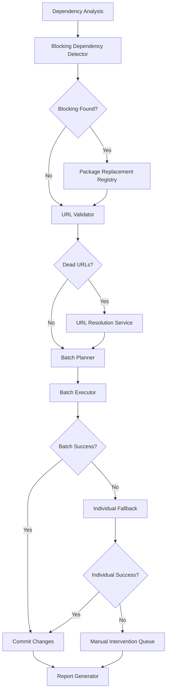

# Smart Dependency Updates - Design Document

## Overview

The Smart Dependency Updates system enhances CodeCrypt's resurrection pipeline by intelligently handling problematic dependencies that cause cascading failures. Instead of the current one-at-a-time update approach that runs `npm install` after each change, this system:

1. **Pre-analyzes** the dependency tree to identify blocking packages before any updates
2. **Applies replacements** for deprecated/incompatible packages (e.g., `node-sass` → `sass`)
3. **Validates URLs** for packages using GitHub archive URLs
4. **Batches updates** to minimize npm install cycles
5. **Provides intelligent fallback** when batch updates fail

## Architecture



## Components and Interfaces

### 1. BlockingDependencyDetector

Identifies packages that will prevent npm install from completing.

```typescript
interface BlockingDependency {
  name: string;
  version: string;
  reason: BlockingReason;
  replacement?: PackageReplacement;
}

type BlockingReason = 
  | 'architecture_incompatible'  // e.g., node-sass on ARM64
  | 'dead_url'                   // GitHub archive URL 404
  | 'deprecated_no_replacement'  // Package deprecated with no alternative
  | 'build_failure'              // Known build issues
  | 'peer_conflict';             // Unresolvable peer dependencies

interface BlockingDependencyDetector {
  detect(dependencies: Map<string, string>): Promise<BlockingDependency[]>;
  isKnownBlocking(packageName: string): boolean;
  getBlockingReason(packageName: string): BlockingReason | null;
}
```

### 2. PackageReplacementRegistry

Maintains mappings from deprecated packages to modern alternatives.

```typescript
interface PackageReplacement {
  originalPackage: string;
  replacementPackage: string;
  versionMapping: Record<string, string>;  // original version → replacement version
  requiresCodeChanges: boolean;
  codeChangeDescription?: string;
  importMappings?: Record<string, string>;  // old import → new import
}

interface PackageReplacementRegistry {
  load(): Promise<void>;
  save(): Promise<void>;
  lookup(packageName: string): PackageReplacement | null;
  add(replacement: PackageReplacement): void;
  getAll(): PackageReplacement[];
}
```

### 3. URLValidator

Validates URL-based package versions before installation.

```typescript
interface URLValidationResult {
  url: string;
  isValid: boolean;
  statusCode?: number;
  alternativeVersion?: string;  // npm registry version if URL is dead
}

interface URLValidator {
  validate(url: string): Promise<URLValidationResult>;
  findNpmAlternative(packageName: string): Promise<string | null>;
  extractPackageFromUrl(url: string): string | null;
}
```

### 4. BatchPlanner

Groups compatible updates into batches for efficient installation.

```typescript
interface UpdateBatch {
  id: string;
  packages: ResurrectionPlanItem[];
  priority: number;
  estimatedRisk: 'low' | 'medium' | 'high';
}

interface BatchPlanner {
  createBatches(planItems: ResurrectionPlanItem[]): UpdateBatch[];
  estimateBatchRisk(batch: UpdateBatch): 'low' | 'medium' | 'high';
  reorderForSafety(batches: UpdateBatch[]): UpdateBatch[];
}
```

### 5. BatchExecutor

Executes batch updates with intelligent fallback.

```typescript
interface BatchExecutionResult {
  batchId: string;
  success: boolean;
  updatedPackages: string[];
  failedPackages: string[];
  error?: string;
  fallbackUsed: boolean;
  flagsUsed: string[];  // e.g., ['--legacy-peer-deps', '--force']
}

interface BatchExecutor {
  execute(batch: UpdateBatch, repoPath: string): Promise<BatchExecutionResult>;
  executeWithFallback(batch: UpdateBatch, repoPath: string): Promise<BatchExecutionResult>;
  applyBatchToPackageJson(batch: UpdateBatch, repoPath: string): Promise<void>;
}
```

### 6. SmartDependencyUpdater

Orchestrates the entire smart update process.

```typescript
interface SmartUpdateResult {
  successful: UpdateResult[];
  failed: UpdateResult[];
  manualIntervention: ManualInterventionItem[];
  replacementsApplied: PackageReplacement[];
  batchesExecuted: number;
  totalNpmInstalls: number;  // Should be much lower than package count
}

interface ManualInterventionItem {
  packageName: string;
  reason: string;
  guidance: string;
  severity: 'warning' | 'error';
}

interface SmartDependencyUpdater {
  analyze(repoPath: string): Promise<SmartAnalysisResult>;
  execute(repoPath: string, plan: ResurrectionPlan): Promise<SmartUpdateResult>;
  generateReport(result: SmartUpdateResult): string;
}
```

## Data Models

### Package Replacement Registry Schema

```typescript
interface ReplacementRegistrySchema {
  version: string;
  lastUpdated: string;
  replacements: PackageReplacement[];
  architectureIncompatible: ArchitectureIncompatibleEntry[];
  knownDeadUrls: string[];
}

interface ArchitectureIncompatibleEntry {
  packageName: string;
  incompatibleArchitectures: string[];  // e.g., ['arm64', 'arm']
  replacement?: string;
  reason: string;
}
```

### Default Registry Content

```json
{
  "version": "1.0.0",
  "replacements": [
    {
      "originalPackage": "node-sass",
      "replacementPackage": "sass",
      "versionMapping": { "*": "^1.69.0" },
      "requiresCodeChanges": false
    },
    {
      "originalPackage": "request",
      "replacementPackage": "node-fetch",
      "versionMapping": { "*": "^3.3.0" },
      "requiresCodeChanges": true,
      "codeChangeDescription": "Replace request() calls with fetch() API"
    }
  ],
  "architectureIncompatible": [
    {
      "packageName": "node-sass",
      "incompatibleArchitectures": ["arm64"],
      "replacement": "sass",
      "reason": "node-sass uses native bindings that don't support ARM64"
    },
    {
      "packageName": "phantomjs",
      "incompatibleArchitectures": ["arm64"],
      "replacement": "puppeteer",
      "reason": "PhantomJS is deprecated and has no ARM64 binaries"
    }
  ],
  "knownDeadUrls": [
    "github.com/substack/querystring"
  ]
}
```

## Correctness Properties

*A property is a characteristic or behavior that should hold true across all valid executions of a system-essentially, a formal statement about what the system should do. Properties serve as the bridge between human-readable specifications and machine-verifiable correctness guarantees.*

### Property 1: Blocking dependency detection completeness
*For any* package.json containing packages from the known blocking list, the BlockingDependencyDetector SHALL identify all blocking packages in its output.
**Validates: Requirements 1.1, 4.1**

### Property 2: Replacement lookup consistency
*For any* blocking or deprecated dependency, if a replacement exists in the registry, the lookup SHALL return that replacement; if no replacement exists, the lookup SHALL return null.
**Validates: Requirements 1.2, 3.2, 4.2**

### Property 3: Replacement priority ordering
*For any* resurrection plan containing package replacements, all replacement items SHALL appear before non-replacement items when sorted by priority.
**Validates: Requirements 1.3**

### Property 4: Batch modification atomicity
*For any* batch of updates, after calling applyBatchToPackageJson, the package.json SHALL contain updated versions for ALL packages in the batch (not a partial subset).
**Validates: Requirements 2.2**

### Property 5: Progress event completeness
*For any* batch execution, the system SHALL emit exactly one progress event per package in the batch.
**Validates: Requirements 2.5**

### Property 6: Package replacement correctness
*For any* package replacement operation, the resulting package.json SHALL contain the replacement package name and version, and SHALL NOT contain the original package name.
**Validates: Requirements 3.3**

### Property 7: Replacement logging completeness
*For any* package replacement, the log entry SHALL contain the original package name, original version, replacement package name, and replacement version.
**Validates: Requirements 3.4**

### Property 8: Architecture check completeness
*For any* set of dependencies, every dependency SHALL be checked against the architecture incompatibility list exactly once.
**Validates: Requirements 4.1**

### Property 9: Report structure completeness
*For any* resurrection result, the generated report SHALL contain sections for successful updates, failed updates, and manual intervention items.
**Validates: Requirements 6.2, 6.4**

### Property 10: Failure categorization completeness
*For any* failed update, the failure SHALL be categorized into exactly one of the defined failure types.
**Validates: Requirements 6.1**

### Property 11: Peer conflict error parsing
*For any* npm error message containing peer dependency conflicts, the parser SHALL extract at least one conflicting package name.
**Validates: Requirements 7.1**

### Property 12: Fallback flag warning
*For any* installation that uses --legacy-peer-deps or --force flags, the system SHALL log a warning message.
**Validates: Requirements 7.4**

### Property 13: Registry serialization round-trip
*For any* valid PackageReplacementRegistry, serializing then deserializing SHALL produce an equivalent registry.
**Validates: Requirements 8.3, 8.4**

### Property 14: Registry entry completeness
*For any* serialized registry entry, the JSON SHALL contain packageName, replacementPackage, versionMapping, and requiresCodeChanges fields.
**Validates: Requirements 8.3**

## Error Handling

### npm Install Failures

```typescript
type NpmInstallError = 
  | { type: 'peer_conflict'; packages: string[]; message: string }
  | { type: 'network'; url: string; statusCode: number }
  | { type: 'build_failure'; package: string; architecture?: string }
  | { type: 'timeout'; duration: number }
  | { type: 'unknown'; message: string };

function parseNpmError(stderr: string): NpmInstallError {
  // Parse npm error output to categorize the failure
}
```

### Retry Strategy

1. First attempt: `npm install`
2. If peer conflict: `npm install --legacy-peer-deps`
3. If still fails: `npm install --force`
4. If still fails: Mark for manual intervention

### Rollback on Batch Failure

When a batch fails:
1. Restore package.json from git
2. Delete node_modules
3. Attempt individual updates for each package in the failed batch
4. Skip packages that fail individually

## Testing Strategy

### Unit Tests

- BlockingDependencyDetector correctly identifies known blocking packages
- PackageReplacementRegistry loads and saves correctly
- URLValidator correctly parses GitHub archive URLs
- BatchPlanner creates appropriate batch groupings
- Error parser correctly categorizes npm errors

### Property-Based Tests

Using `fast-check` for property-based testing:

1. **Blocking detection property**: For any generated package.json with known blocking packages, all blocking packages are detected
2. **Batch atomicity property**: For any batch, package.json modifications are all-or-nothing
3. **Registry round-trip property**: Serialize then deserialize produces equivalent registry
4. **Report completeness property**: All update results appear in exactly one report section

### Integration Tests

- End-to-end test with a repository containing node-sass
- End-to-end test with a repository containing dead GitHub URLs
- Batch update test with mixed success/failure packages

## Implementation Notes

### Batch Size Heuristics

- Maximum batch size: 10 packages
- Security updates: Always in separate batch (priority)
- Major version updates: Separate batch (higher risk)
- Minor/patch updates: Can be batched together

### Performance Considerations

- URL validation uses HEAD requests (not GET) to minimize bandwidth
- Registry is loaded once at startup and cached
- Batch execution reduces npm install calls from N to ~N/10

### Extensibility

The PackageReplacementRegistry is designed to be:
- Loaded from a JSON file (user-configurable)
- Extended at runtime when new replacements are discovered
- Shareable across CodeCrypt installations
